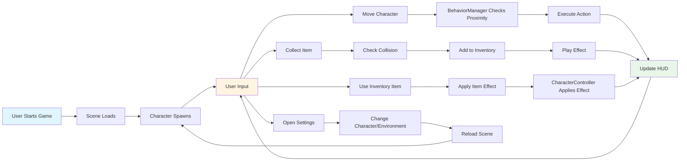
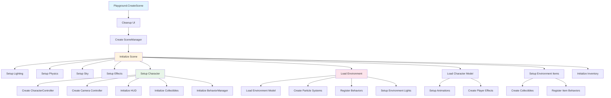

# Babylon Game Starter - User's Guide

## Introduction

Welcome to **Babylon Game Starter**, a powerful, modular framework for creating 3D games in the Babylon.js Playground. This system provides a complete foundation for building interactive 3D experiences with minimal setup, allowing you to focus on creativity and game design rather than infrastructure.

### What is Babylon Game Starter?

Babylon Game Starter is a configuration-driven game development framework that transforms the Babylon.js Playground into a full-featured game engine. It provides a complete set of managers, controllers, and systems that work together to handle everything from character movement to inventory management, from particle effects to behavior triggers.

### Major Features

- **Modular Manager Architecture**: Clean separation of concerns with dedicated managers for each system
- **Configuration-Driven Design**: Customize your game through simple configuration files—no code changes needed for most features
- **Type-Safe TypeScript**: Full type safety throughout the codebase with no `any` types
- **Behavior System**: Proximity-based triggers with configurable actions (adjust credits, apply effects, etc.)
- **Collectibles & Inventory**: Complete item collection system with inventory management
- **Particle Effects System**: Easy integration of particle effects from Babylon.js snippets
- **Physics-Based Movement**: Realistic character movement with Havok physics integration
- **Multiple Environments**: Switch between different game worlds seamlessly
- **Mobile Controls**: Built-in touch controls for mobile devices
- **HUD System**: Comprehensive heads-up display with credits, boost status, and more
- **Sky & Lighting**: Dynamic sky system with configurable lighting
- **Camera System**: Smooth following camera with drag controls and zoom
- **Animation System**: Character animation blending and state management

### Benefits for Game Developers

- **Rapid Prototyping**: Get a working game running in minutes, not hours
- **Easy Customization**: Modify game behavior through configuration files
- **Extensible Architecture**: Add new features by extending existing managers
- **No Build Step**: Works directly in the Babylon.js Playground—no compilation needed
- **Community Ready**: Share your creations easily with the #BabylonGameStarter hashtag
- **Type Safety**: Catch errors at development time, not runtime
- **Best Practices**: Built-in patterns for common game development tasks

### Target Audience

This guide is designed for:
- Game developers looking to prototype 3D games quickly
- Educators teaching game development concepts
- Hobbyists exploring 3D game creation
- Developers familiar with TypeScript and JavaScript
- Anyone wanting to create interactive 3D experiences in the browser

---

## System Architecture

Babylon Game Starter follows a modular, manager-based architecture where each system is handled by a dedicated manager class. This design provides clear separation of concerns, making the codebase easy to understand, extend, and maintain.

### High-Level Architecture

The system is organized into several key layers:

1. **Entry Point** (`index.ts`): Initializes the playground and coordinates UI setup
2. **Scene Manager**: Orchestrates all systems and manages the game scene
3. **Managers**: Handle specific subsystems (effects, inventory, collectibles, etc.)
4. **Controllers**: Manage gameplay mechanics (character movement, camera, animations)
5. **Configuration**: Data-driven game behavior through config files
6. **UI Components**: User interface for settings and inventory

### Manager-Based Modular Design

Each manager is responsible for a specific aspect of the game:

- **SceneManager**: Scene initialization, environment loading, system coordination
- **CharacterController**: Character movement, physics, item effects
- **CollectiblesManager**: Item collection, physics bodies, credit management
- **InventoryManager**: Inventory storage, item usage, effect application
- **BehaviorManager**: Proximity triggers, behavior actions, effect application
- **EffectsManager**: Particle systems, sounds, visual effects
- **HUDManager**: Heads-up display, UI updates
- **CameraManager**: Camera positioning and controls
- **SkyManager**: Sky textures and environment lighting
- **NodeMaterialManager**: Node Material Editor material processing

### Configuration-Driven Approach

The system is designed to be customized primarily through configuration files:

- `config/assets.ts`: Characters, environments, items, particles
- `config/game-config.ts`: Core game settings (speeds, physics, effects)
- `config/input-keys.ts`: Keyboard input mappings
- `config/mobile-controls.ts`: Touch control configuration
- `config/character-states.ts`: Character state definitions

This approach means you can create entirely different games by changing configuration files without modifying the core code.

### System Component Relationships


---

## Core Systems

### Scene Management

The **SceneManager** is the central orchestrator of the entire system. It:
- Initializes the Babylon.js scene and physics engine
- Loads environments and coordinates all other managers
- Manages character loading and switching
- Handles environment transitions
- Sets up lighting and sky systems

**Key Methods:**
- `loadEnvironment(environmentName)`: Loads a new game environment
- `setupEnvironmentItems()`: Sets up collectibles for the current environment
- `changeCharacter(characterIndexOrName)`: Switches the active character

### Character System

The **CharacterController** handles all character-related functionality:
- Physics-based movement with Havok integration
- Jump mechanics with configurable height and delay
- Boost/sprint system
- Rotation smoothing
- Item effect application (super jump, invisibility, etc.)
- Display capsule for physics visualization

**Features:**
- Configurable movement speeds (ground, air, boost)
- Character-specific properties (mass, height, radius)
- Animation state management
- Mobile and keyboard input support

### Environment System

Environments are complete 3D worlds that can be loaded and switched at runtime:

**Environment Components:**
- 3D model (GLB/GLTF format)
- Spawn point and rotation
- Sky configuration
- Particle effects
- Collectible items
- Physics objects
- Lighting configuration
- Background music
- Ambient sounds

**Example Environment Configuration:**
```typescript
{
    name: "Level Test",
    model: "https://.../levelTest.glb",
    spawnPoint: new BABYLON.Vector3(3, 0.5, -8),
    sky: {
        TEXTURE_URL: "https://.../sky.jpg",
        TYPE: "SPHERE"
    },
    particles: [ /* particle configs */ ],
    items: [ /* item configs */ ]
}
```

### Collectibles & Inventory

The **CollectiblesManager** handles item collection:
- Automatic item spawning from configuration
- Physics-based collection detection
- Credit system integration
- Collection sound effects
- Particle effects on collection
- Inventory integration

The **InventoryManager** manages player inventory:
- Item storage and retrieval
- Item usage and effect application
- Effect duration management
- Inventory UI integration

**Item Types:**
- Collectibles: Items that can be picked up
- Inventory Items: Items stored for later use
- Effect Items: Items that apply temporary effects

### Behavior System

The **BehaviorManager** enables proximity-based interactions:

**Behavior Features:**
- Proximity triggers with configurable radius
- Periodic action execution (every frame or at intervals)
- Visual effects (glow) on proximity
- Actions (adjust credits, apply effects, etc.)
- Support for meshes and particle systems

**Example Behavior:**
```typescript
behavior: {
    triggerKind: "proximity",
    radius: 3,
    checkPeriod: { type: "interval", milliseconds: 5000 },
    action: {
        actionType: "adjustCredits",
        amount: -5
    }
}
```

### Effects System

The **EffectsManager** handles all visual and audio effects:

**Particle Systems:**
- Integration with Babylon.js particle snippets
- Environment particles
- Item collection effects
- Player effects (thruster, boost)

**Audio:**
- Background music with crossfading
- Ambient positional sounds
- Sound effects
- Volume management

**Visual Effects:**
- Glow effects on meshes
- Edge rendering
- Material effects

### Physics System

Physics is handled through Havok physics integration:
- Character physics controller
- Dynamic and static objects
- Collision detection
- Physics-based collectibles
- Configurable gravity and friction

### Camera System

The **SmoothFollowCameraController** provides:
- Smooth camera following
- Drag controls for camera rotation
- Zoom functionality
- Configurable offset and smoothing
- Environment-specific camera settings

### HUD System

The **HUDManager** displays:
- Credits counter
- Boost status
- Character state
- Coordinates
- Time elapsed
- FPS counter

All HUD elements are configurable and can be toggled for mobile/desktop.

### Mobile Controls

The **MobileInputManager** provides:
- Virtual joystick for movement
- Action buttons (jump, boost)
- Touch-optimized controls
- Configurable opacity and positioning
- Automatic device detection

---

## System Interactions

### Manager Interaction Flow


### User Interaction Flow



### Initialization Sequence



---

## Manifesting Your Game Narrative

### Introduction: The Quality Without a Name

In his GDC talk, Jesse Schell explores Christopher Alexander's philosophy of creating spaces and experiences that have "the quality without a name"—that feeling when something is just right, when it feels alive, whole, comfortable, free, exact, egoless, and eternal. Alexander identified 15 fundamental properties that create this quality, and Schell shows how these apply to game narratives.

This section will guide you through using Babylon Game Starter to manifest game narratives that embody these 15 properties, creating experiences that feel truly alive and meaningful.

### The 15 Properties and How to Manifest Them

#### 1. Levels of Scale

**What it means for narratives:** Great narratives work at multiple levels simultaneously—the big picture (plot), the medium level (characters), and the small details (dialogue, moments).

**How to manifest it in Babylon Game Starter:**

- **Large Scale (Plot/World):** Use environments to represent major story arcs. Each environment can be a different chapter or act of your narrative.
- **Medium Scale (Characters):** Different characters can represent different perspectives or roles in your story. Use character switching to show the same events from different viewpoints.
- **Small Scale (Moments):** Use behaviors and collectibles to create small narrative moments. A particle effect that triggers when the player approaches can be a moment of discovery.

**Example Configuration:**
```typescript
// Large scale: Different environments for different story chapters
ENVIRONMENTS: [
    { name: "Chapter 1: The Beginning", /* ... */ },
    { name: "Chapter 2: The Journey", /* ... */ },
    { name: "Chapter 3: The Resolution", /* ... */ }
]

// Medium scale: Characters with different roles
CHARACTERS: [
    { name: "The Hero", /* ... */ },
    { name: "The Guide", /* ... */ },
    { name: "The Antagonist", /* ... */ }
]

// Small scale: Behaviors that create moments
particles: [{
    name: "Magic Sparkles",
    behavior: {
        triggerKind: "proximity",
        radius: 3,
        action: { actionType: "adjustCredits", amount: 10 }
    }
}]
```

#### 2. Strong Centers

**What it means for narratives:** Every good story has strong centers—key locations, characters, or moments that everything else revolves around.

**How to manifest it in Babylon Game Starter:**

- Create a central location in your environment that serves as a hub
- Use particle effects or special lighting to mark important centers
- Design collectibles that lead players toward the center
- Use behaviors to make centers feel special (glow effects, special sounds)

**Example:**
```typescript
// Create a strong center with special effects
particles: [{
    name: "Portal Effect",
    position: new BABYLON.Vector3(0, 0, 0), // Center of world
    behavior: {
        triggerKind: "proximity",
        radius: 5,
        edgeColor: new BABYLON.Color4(1, 1, 0, 1), // Golden glow
        edgeWidth: 10
    }
}]
```

#### 3. Boundaries

**What it means for narratives:** Boundaries create meaning. Thresholds in stories mark important transitions. Conflicts arise when boundaries clash.

**How to manifest it in Babylon Game Starter:**

- Use environment transitions to create narrative boundaries
- Create behaviors that trigger when crossing boundaries (entering/leaving areas)
- Use `triggerOutOfRange` to create behaviors that activate outside a radius
- Design collectibles that mark boundaries

**Example:**
```typescript
// Boundary behavior: Something happens when you leave an area
items: [{
    instances: [{
        behavior: {
            triggerKind: "proximity",
            triggerOutOfRange: true, // Triggers when OUTSIDE radius
            radius: 4,
            edgeColor: new BABYLON.Color4(0, 1, 0, 1), // Green = safe zone
            action: { actionType: "adjustCredits", amount: -1 } // Lose credits outside
        }
    }]
}]
```

#### 4. Alternating Repetition

**What it means for narratives:** The rhythm of tension and release, action and reflection. Like flow state—not constant intensity, but alternating between challenge and rest.

**How to manifest it in Babylon Game Starter:**

- Alternate between intense areas (many behaviors, effects) and calm areas
- Use particle effects to create rhythm (some areas have effects, others don't)
- Design collectible placement to create alternating patterns
- Use background music changes to signal rhythm shifts

**Example:**
```typescript
// Create alternating rhythm with behaviors
// Intense area: Many particle effects and behaviors
particles: [
    { name: "Fire Trail", position: new BABYLON.Vector3(0, 0, 0) },
    { name: "Energy Field", position: new BABYLON.Vector3(5, 0, 0) }
]

// Calm area: Minimal effects, just ambient sounds
// (no particles, just background music)
```

#### 5. Positive Space

**What it means for narratives:** In dialogue, positive space is what's said; negative space is silence or what others say. Both need to be well-shaped.

**How to manifest it in Babylon Game Starter:**

- Use particle effects as "positive space" (active, visible)
- Use empty areas as "negative space" (calm, reflective)
- Balance collectibles (positive) with empty exploration areas (negative)
- Use sound and silence effectively

**Example:**
```typescript
// Positive space: Active, engaging areas
particles: [{ name: "Magic Sparkles", /* ... */ }]
items: [/* collectibles */]

// Negative space: Empty, contemplative areas
// (no particles, minimal items, just exploration)
```

#### 6. Good Shape

**What it means for narratives:** When things serve their purpose perfectly, they naturally take on beautiful shapes. In narratives, this means the structure serves the story.

**How to manifest it in Babylon Game Starter:**

- Design environments where form follows function
- Create collectible placement patterns that feel natural
- Use behaviors that make sense (proximity to dangerous areas = lose credits)
- Design particle effects that match their narrative purpose

**Example:**
```typescript
// Good shape: Behavior that matches its purpose
// Dangerous area should have warning behaviors
particles: [{
    name: "Fire Trail",
    position: new BABYLON.Vector3(10, 0, 0), // Dangerous area
    behavior: {
        triggerKind: "proximity",
        radius: 2,
        action: { actionType: "adjustCredits", amount: -5 } // Penalty for danger
    }
}]
```

#### 7. Local Symmetries

**What it means for narratives:** Different parts of the story have their own internal logic and symmetry, but they're not all the same. Like characters—each has their own completeness.

**How to manifest it in Babylon Game Starter:**

- Create different areas with their own internal logic
- Use different particle effects in different areas (each area has its own "theme")
- Design character-specific behaviors
- Create environment-specific collectible types

**Example:**
```typescript
// Each environment has its own "local symmetry"
ENVIRONMENTS: [
    {
        name: "Fire Realm",
        particles: [{ name: "Fire Trail" }], // Fire theme
        items: [{ name: "Fire Crystal" }] // Fire collectibles
    },
    {
        name: "Ice Realm",
        particles: [{ name: "Stardust" }], // Ice theme
        items: [{ name: "Ice Crystal" }] // Ice collectibles
    }
]
```

#### 8. Deep Interlock

**What it means for narratives:** When the player's story (what they experience) and the designer's story (what you intended) interlock perfectly. Like a dovetail joint—neither is in charge, both are essential.

**How to manifest it in Babylon Game Starter:**

- Use behaviors that respond to player actions naturally
- Create collectibles that feel meaningful to collect
- Design effects that enhance player agency
- Use proximity triggers that feel like natural discoveries

**Example:**
```typescript
// Deep interlock: Player discovers behaviors through exploration
// The behavior exists whether player finds it or not
particles: [{
    name: "Magic Sparkles",
    position: new BABYLON.Vector3(-2, 0, -8), // Hidden location
    behavior: {
        triggerKind: "proximity",
        radius: 3,
        action: { actionType: "adjustCredits", amount: 10 } // Reward for discovery
    }
}]
```

#### 9. Contrast

**What it means for narratives:** The unity of opposites. Comedy comes from contrast. Serious moments are made more serious by contrast with humor.

**How to manifest it in Babylon Game Starter:**

- Alternate between serious and lighthearted areas
- Use contrasting particle effects (fire vs. water, light vs. dark)
- Create behaviors with contrasting outcomes (gain vs. lose credits)
- Design characters with contrasting personalities

**Example:**
```typescript
// Contrast: Dangerous area vs. safe area
particles: [
    {
        name: "Fire Trail", // Dangerous
        behavior: { action: { actionType: "adjustCredits", amount: -5 } }
    },
    {
        name: "Magic Sparkles", // Safe/beneficial
        behavior: { action: { actionType: "adjustCredits", amount: 10 } }
    }
]
```

#### 10. Gradients

**What it means for narratives:** Gradual changes over time. Not sudden jumps, but smooth transitions.

**How to manifest it in Babylon Game Starter:**

- Use particle effects with gradual changes (fade in/out)
- Create credit systems that change gradually
- Design environments that transition smoothly
- Use background music crossfading for smooth transitions

**Example:**
```typescript
// Gradients: Background music crossfades smoothly
backgroundMusic: {
    url: "https://.../music.mp3",
    volume: 0.03 // Gradual volume
}

// Particle effects with gradual properties
particles: [{
    name: "Nebula Cloud", // Gradual, flowing effect
    updateSpeed: 0.007 // Slow, gradual movement
}]
```

#### 11. Roughness

**What it means for narratives:** Imperfection makes things feel real. Too much polish can feel artificial. Roughness adds authenticity.

**How to manifest it in Babylon Game Starter:**

- Don't make everything perfect—leave some areas less polished
- Use varied particle effect timings (not all synchronized)
- Create environments with some "rough edges"
- Allow for emergent gameplay through imperfect systems

**Example:**
```typescript
// Roughness: Not all particles have the same update speed
particles: [
    { name: "Magic Sparkles", updateSpeed: 0.007 },
    { name: "Dust Storm", updateSpeed: 0.012 }, // Different, rougher
    { name: "Smoke Trail", updateSpeed: 0.009 } // Varied
]
```

#### 12. Echoes

**What it means for narratives:** Recurring themes, motifs, and patterns that connect different parts of the story. Like musical themes that return.

**How to manifest it in Babylon Game Starter:**

- Reuse particle effects across environments (with variations)
- Create recurring collectible types
- Use similar behaviors in different contexts
- Design character abilities that echo each other

**Example:**
```typescript
// Echoes: Same particle effect used in different environments
// but with different behaviors
ENVIRONMENTS: [
    {
        name: "Forest",
        particles: [{
            name: "Magic Sparkles", // Echo
            behavior: { action: { actionType: "adjustCredits", amount: 5 } }
        }]
    },
    {
        name: "Cave",
        particles: [{
            name: "Magic Sparkles", // Same effect, different context
            behavior: { action: { actionType: "adjustCredits", amount: 10 } }
        }]
    }
]
```

#### 13. The Void

**What it means for narratives:** Empty spaces where important things happen. Silence in dialogue. The cave in the hero's journey. Boss battle arenas.

**How to manifest it in Babylon Game Starter:**

- Create empty areas with no particles or collectibles
- Use void spaces for important encounters
- Design boss battle areas as voids (empty except for the encounter)
- Use silence (no background music) in key moments

**Example:**
```typescript
// The Void: Empty space for important encounters
// No particles, no collectibles, just space
// This area becomes important because of what's NOT there
// (Add important encounter here through other means)
```

#### 14. Simplicity and Inner Calm

**What it means for narratives:** When everything unnecessary is removed, what remains has a quiet strength. Simple mechanics done well.

**How to manifest it in Babylon Game Starter:**

- Use simple, clear behaviors
- Create environments with minimal but meaningful elements
- Design collectibles with clear purposes
- Avoid over-complicating configurations

**Example:**
```typescript
// Simplicity: One clear behavior, well-executed
particles: [{
    name: "Magic Sparkles",
    behavior: {
        triggerKind: "proximity",
        radius: 3,
        action: { actionType: "adjustCredits", amount: 10 }
    }
}]
// Simple, clear, effective
```

#### 15. Not-Separateness

**What it means for narratives:** Everything is connected. The player's experience, the game's systems, the narrative—all interwoven. Like Brothers: A Tale of Two Sons, where the control scheme, the story, and the player's neurology all connect.

**How to manifest it in Babylon Game Starter:**

- Design behaviors that connect gameplay to narrative
- Create collectibles that matter to both systems and story
- Use effects that enhance both gameplay and atmosphere
- Design environments where form and function are one

**Example:**
```typescript
// Not-Separateness: Behavior connects gameplay and narrative
particles: [{
    name: "Portal Effect", // Narrative: portal to another world
    behavior: {
        triggerKind: "proximity",
        radius: 5,
        action: { actionType: "adjustCredits", amount: 100 } // Gameplay: reward
    }
}]
// The portal IS the reward, the reward IS the portal
// They cannot be separated
```

### Creating Narratives with "The Quality Without a Name"

To create narratives that have "the quality without a name," focus on:

1. **Feeling Over Logic**: Does it feel right? Test it, change it until all imperfection is gone.

2. **Multiple Levels**: Ensure your narrative works at plot level, character level, and moment level.

3. **Strong Centers**: Identify what's central to your story and make those elements strong.

4. **Natural Boundaries**: Let boundaries emerge from your narrative needs, not arbitrary rules.

5. **Rhythm**: Create alternating repetition—tension and release, action and reflection.

6. **Balance**: Balance positive space (active elements) with negative space (empty, contemplative areas).

7. **Purpose**: Let form follow function. If it serves its purpose perfectly, it will have good shape.

8. **Local Completeness**: Each area, each character, each moment should feel complete in itself.

9. **Interconnection**: Design so player story and designer story interlock deeply.

10. **Contrast**: Use opposites to strengthen each other.

11. **Gradual Change**: Prefer gradients over sudden jumps.

12. **Authenticity**: Allow roughness—imperfection makes things feel real.

13. **Recurring Themes**: Create echoes that connect different parts.

14. **Empty Spaces**: Use voids where important things happen.

15. **Simplicity**: Remove everything unnecessary. What remains will have inner calm.

16. **Unity**: Design so everything connects—gameplay, narrative, systems, all one.

### Practical Workflow

1. **Start with Feeling**: What feeling do you want players to have? Write it down.

2. **Identify Centers**: What are the strong centers of your narrative? Mark them in your environment.

3. **Create Boundaries**: Where are the thresholds? Use behaviors to mark them.

4. **Design Rhythm**: Plan alternating repetition. Map out intense and calm areas.

5. **Balance Space**: Design positive spaces (active) and negative spaces (empty).

6. **Test and Refine**: Play your game. Does it feel right? Change what doesn't. Keep what does.

7. **Add Layers**: Once the base feels right, add details—particles, sounds, behaviors.

8. **Connect Everything**: Ensure gameplay, narrative, and systems all support each other.

### Example: A Complete Narrative Configuration

```typescript
// A narrative that embodies the 15 properties
ENVIRONMENTS: [{
    name: "The Journey Begins",
    
    // Strong Center: The starting point
    spawnPoint: new BABYLON.Vector3(0, 0, 0),
    
    // Levels of Scale:
    // Large: The environment itself (the journey)
    // Medium: Key locations (the centers)
    // Small: Individual moments (behaviors)
    
    // Strong Centers: Marked with special effects
    particles: [
        {
            name: "Portal Effect",
            position: new BABYLON.Vector3(0, 0, 0), // Center
            behavior: {
                triggerKind: "proximity",
                radius: 5,
                edgeColor: new BABYLON.Color4(1, 1, 0, 1),
                edgeWidth: 10
            }
        }
    ],
    
    // Boundaries: Safe zone vs. danger zone
    items: [{
        instances: [{
            position: new BABYLON.Vector3(10, 0, 0),
            behavior: {
                triggerKind: "proximity",
                triggerOutOfRange: true, // Boundary marker
                radius: 4,
                edgeColor: new BABYLON.Color4(0, 1, 0, 1) // Green = safe
            }
        }]
    }],
    
    // Alternating Repetition: Intense and calm areas
    particles: [
        { name: "Fire Trail", position: new BABYLON.Vector3(5, 0, 0) }, // Intense
        // Empty area at (0, 0, 0) for calm
        { name: "Magic Sparkles", position: new BABYLON.Vector3(-5, 0, 0) } // Reward
    ],
    
    // The Void: Empty space for important encounter
    // (Area at (15, 0, 0) with no particles - becomes important)
    
    // Echoes: Recurring collectible type
    items: [
        { name: "Journey Crystal", /* ... */ },
        { name: "Journey Crystal", /* ... */ } // Echo
    ],
    
    // Simplicity: Clear, simple behaviors
    // Each behavior has one clear purpose
    
    // Not-Separateness: Everything connects
    // Collectibles give credits AND tell story
    // Behaviors affect gameplay AND narrative
}]
```

---

## Conclusion

Babylon Game Starter provides a powerful foundation for creating 3D games that feel alive and meaningful. By understanding the system architecture and applying the principles of Christopher Alexander's 15 properties, you can create game narratives that have "the quality without a name"—experiences that feel right, whole, and eternal.

Remember: The timeless way of building games is to do what feels right, test it, and change it until all imperfection is gone. Start simple, add layers, and let your narrative emerge naturally from the interaction between player, systems, and story.

**Happy creating! Share your narratives with #BabylonGameStarter!**

---

## Resources

- [Babylon.js Documentation](https://doc.babylonjs.com/)
- [Babylon.js Forum](https://forum.babylonjs.com/)
- [Babylon Game Starter Playground](https://playground.babylonjs.com/?inspectorv2=true#41W5EV)
- [Node Material Editor](https://nme.babylonjs.com/)
- [Christopher Alexander - A Pattern Language](https://www.patternlanguage.com/)
- [Jesse Schell - The Art of Game Design](https://schellgames.com/art-of-game-design)

